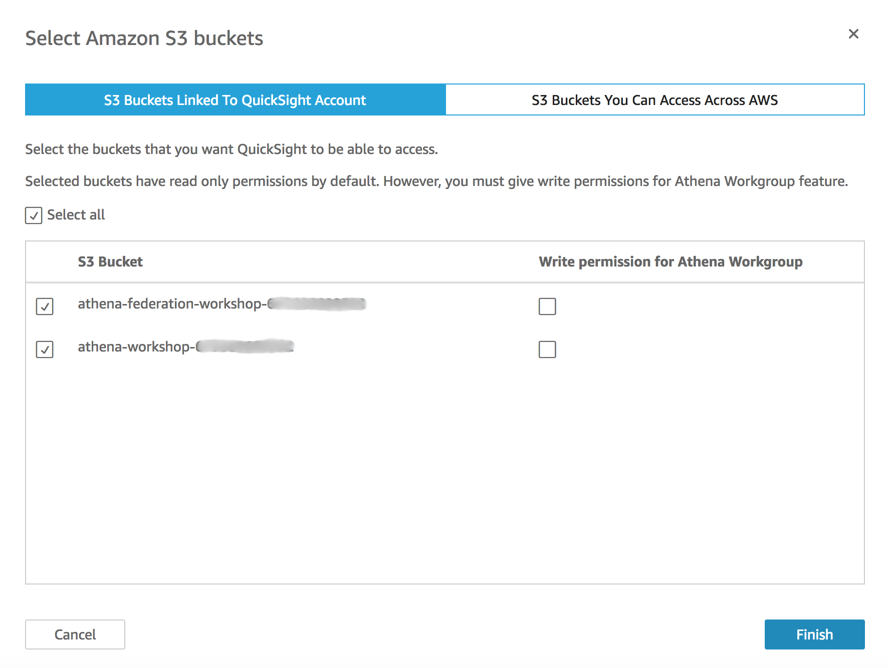
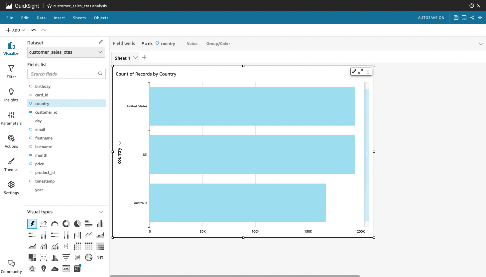
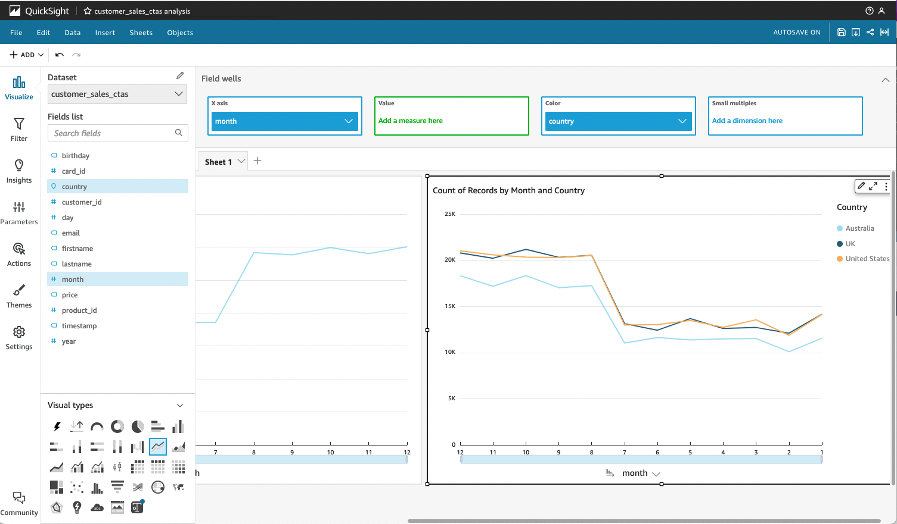
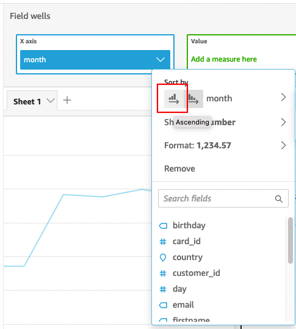

---

Trong bài lab này, chúng ta sẽ xây dựng Bảng điều khiển Amazon QuickSight mà nó sử dụng Amazon Athena để truy cập dữ liệu.

{}
Trước khi bạn bắt đầu thiết lập Quicksight, chúng ta cần đăng xuất khỏi AWS và đăng nhập lại với người dùng có quyền thiết lập QuickSight. Điều này là do trong bài lab về Workgroups, chúng ta đã đăng nhập vào AWS với tư cách UserA để kiểm tra các quyền của Athena Workgroups.
Để thoát ra:

1. Nhấp vào username ở góc trên bên phải của trang.
2. Nhấp vào nút **Sign out**

3. **Self Paced Labs** - Đăng nhập lại vào Bảng điều khiển AWS của bạn với tư cách là người dùng IAM có quyền thiết lập QuickSight.
{}

### Thiết lập QuickSight
Sau khi đăng nhập lại, hãy thiết lập Amazon Quicksight
1. Tìm kiếm **Quicksight** ở thanh tìm kiếm rồi chọn. Thao tác này sẽ đưa bạn đến trang đích **QuickSight**

2. Nếu Tài khoản AWS của bạn chưa đăng ký QuickSight, bạn sẽ được nhắc đăng ký. Bấm vào **Sign up for Quicksight**

3. Chọn Enterprise edition và nhấp vào Continue.

4. Trên màn hình tiếp theo, nếu bạn nhận được lời nhắc **Get Paginated add-on**, hãy nhấp vào 1. **No,Maybe later**
5. Chọn **Create your Quicksight account** như sau:
- **Select a region** của bạn từ danh sách đươc cuộn xuống
- Nhập tên tài khoản QuickSight duy nhất.

``
Tên tài khoản chỉ được chứa ký tự (A-Za-z), chữ số (0-9) và dấu gạch ngang (-)
Nhập địa chỉ email để QuickSight gửi các thông báo quan trọng. Giữ tất cả các giá trị mặc định khác.
``

6. Trong phần **QuickSight Access to AWS Services,** hãy làm như sau:
- Kiểm tra **Amazon S3.** Thao tác này sẽ mở ra một cửa sổ bật lên để chọn nhóm S3.
- Đánh dấu vào ô **Select All** và nhấn nút **Finish.**

7. Nhấp vào nút **Finish**. Tài khoản QuickSight của bạn bây giờ sẽ được tạo.

Sau khi hoàn thành, bạn sẽ thấy thông báo **Congratulations**

1. Nhấp vào nút **Go to Amazon QuickSight**. Thao tác này sẽ tải Quicksight. *LƯU Ý: Nếu bạn nhận được thông báo về các tính năng bật lên, bạn có thể đóng nó lại.*
### Tạo Quicksight Datasets
Bây giờ, chúng ta sẽ tạo một tập dữ liệu mới cho bảng thông tin QuickSight kết nối với một trong các bảng mà chúng ta đã tạo trong Athena.

9. Chọn **New Analysis** ở góc trên cùng bên phải. Điều này sẽ hiển thị một danh sách datasets hiện có. Chúng ta sẽ tạo một tập dữ liệu mới vì vậy hãy nhấp vào nút **New dataset** ở góc trên cùng bên trái.

10. Bạn sẽ thấy Quicksight có thể kết nối với nhiều nguồn dữ liệu khác nhau. Xác định vị trí biểu tượng **Athena** và chọn nó.

11. Đối với Data source name, hãy nhập **“athenaimmersion”** và chọn **Create Data Source**

12. Trên Next screen, chọn cơ sở dữ liệu **“default“** và chọn bảng **customer_sale_ctas** rồi chọn **Select**

13. Ở phần **finish data set creation**, chọn tùy chọn **“Directly query your data”** và chọn tiếp mục **Visualize.** 

14. Bây giờ bạn sẽ thấy trình chỉnh sửa phân tích QuickSight mà chúng ta sẽ sử dụng để tạo phân tích mới.

**Tạo biểu đồ QuickSight**
Trong phần này, chúng ta sẽ tạo một phân tích rất đơn giản bằng cách sử dụng customer sales data set.

1. Từ Fields List, kéo **country** vào AutoGraph Box. QuickSight tự động chọn loại Horizontal bar chart. Bạn sẽ thấy số lượng hồ sơ bán hàng theo Country.

 xây dựng một biểu đồ khác.

1. Nhấp vào khoảng trống màu xám bên dưới biểu đồ thanh hiện có.
2. Từ danh sách Field, nhấp vào **Month**. Điều này sẽ thêm một Horizontal bar chart mới vào trang phân tích
3. Dữ liệu này có thể trông đẹp hơn dưới dạng line chart. Trong ngăn "Visual Types”, hãy tìm loại **Line Chart** và nhấp vào nó. Lưu ý cách loại biểu đồ tự động thay đổi từ bar chart sang line chart.
4. Sẽ rất tốt nếu xem số lượng giao dịch ở mỗi quốc gia. Từ Field List, nhấp vào **country**. Lưu ý cách line chart tự động làm mới và bây giờ chúng ta có mỗi đường cho mỗi quốc gia. 

5.  Hãy chú ý đến biểu đồ, các tháng ở trục dưới cùng đang bị sai thứ tự. Để khắc phục điều đó, hãy nhấp vào thanh màu xám phía trên biểu đồ có tên **Field Wells.** Thanh Field Wells sẽ mở rộng.

6. Trong X-Axis box, bạn sẽ thấy **month** trường. Chọn vào mũi tên xuống ở phía bên phải của file. Điều này sẽ hiển thị một menu. Trong phần **Sort by** theo ở đầu menu hãy nhấp vào biểu tượng **sort ascending**. Lưu ý rằng các tháng ở trục dưới cùng hiện đã theo đúng thứ tự.

Bây giờ bạn đã sử dụng thành công Amazon QuickSight để kết nối với dữ liệu của mình thông qua Amazon Athena.