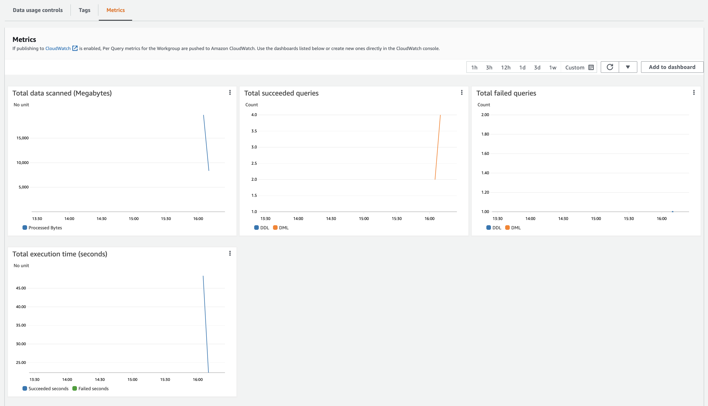

---

Trong Amazon Athena, bạn có thể sử dụng workgroups để chia người dùng, nhóm, ứng dụng hoặc khối lượng công việc, để đặt giới hạn về lượng dữ liệu mà mỗi truy vấn hoặc toàn bộ workgroups có thể xử lý và theo dõi chi phí. Vì workgroups hoạt động như tài nguyên nên bạn có thể sử dụng các chính sách dựa trên danh tính ở cấp độ tài nguyên để kiểm soát quyền truy cập vào workgroups cụ thể.

**Viewings  Cloudwatch Metrics**

Trong bài lab Tạo bảng, chúng ta đã bật số liệu Cloudwatch cho primary workgroup. Bây giờ, hãy xem số liệu Cloudwatch cho primary workgroup của chúng ta trong bảng điều khiển Athena.

1. Từ bảng điều khiển Athena, chọn **Workgroups** từ menu bên trái.
2. Chọn **primary** workgroup từ danh sách workgroups
3. Nhấp vào tab **Metrics** trên màn hình chi tiết Workgroups. Bạn sẽ thấy các metrics bao gồm:
- Total data scanned
- Totoal succeeded queries
- Total failed queries
- Total execution time

{}
Biểu đồ có thể không hiển thị nhiều điểm dữ liệu vì chúng sẽ phản ánh việc sử dụng tài khoản lab của chúng ta.
{}

### Thực thi các hạn chế về chi phí

Chi phí cho truy vấn Athena SQL dựa trên lượng dữ liệu được quét. Với workgroups, bạn có thể thực thi các ràng buộc về chi phí cho các truy vấn bằng cách đặt lượng dữ liệu tối đa mà một truy vấn hoặc workgroups có thể quét. Điều này sẽ được thể hiện bằng cách đặt giới hạn cho workgroup, sau đó đăng nhập bằng người dùng mới để kiểm tra xem giới hạn hoạt động như thế nào.

Bây giờ chúng ta sẽ đặt lượng dữ liệu tối đa có thể được quét bởi bất kỳ truy vấn nào trong workgroups.

1. Trong menu bên trái, xác định vị trí và chọn **Workgroups**. Sau đó nhấn **WorkgroupA** để xem chi tiết workgroups.

2. Ở mục **Data Usage controls** tabs, chọn **Manage**

3. Đặt dữ liệu tối đa được quét bởi bất kỳ truy vấn nào trong nhóm làm việc này là 1**10 Megabytes (MB)**, sau đó chọn **Save**

**Kiểm tra giới hạn workgroup**
Để kiểm tra giới hạn Workgroup mới, chúng ta sẽ đăng nhập với tư cách người dùng mới. Trước khi thực hiện việc này, bạn cần truy xuất thông tin chi tiết về người dùng mới, bao gồm mật khẩu và liên kết đăng nhập.

1. Trong thanh tìm kiếm gõ **Cloudformation** và chọn **CloudFormation** từ kết quả tìm kiếm

2. Trên bảng điều khiển CloudFormation, nhấp vào tên của workshop stack, ví dụ: athena-workshop
3. Nhấp vào tab **Outputs** và bấm vào liên kết **ConsolePassword**. Thao tác này sẽ đưa bạn đến AWS Secrets Manager.

4. Bấm vào link **Secret Name** như hình dưới đây:

5. Chọn **Retrieve secret value** như hình dưới đây:

6. Bấm vào biểu tượng sao chép để sao chép mật khẩu vào clipboard

7. Quay lại tab đầu ra Cloudformation (tham khảo các bước 1,2,3 ở trên) và nhấp vào liên kết **ConsoleLogin**. Thao tác này sẽ mở trang đăng nhập bảng điều khiển AWS.
8. Nhập các giá trị sau và nhấp vào mục **Sign In**

    1. **IAM user name:** userA

    2. **Password:** Sử dụng mật khẩu đã sao chép từ bước ở trên

Sau khi bạn đã đăng nhập thành công với tư cách UserA:

9. Mở bảng điều khiển Athena bằng cách nhập **Athena** vào thanh tìm kiếm ở đầu màn hình. Chọn **Athena** từ kết quả tìm kiếm.

10. Nhấn vào phần cuộn xuống ở **Workgroup** và chọn **WorkgroupA.**

11. Nếu nhận được lời nhắc bên dưới, hãy chọn **Acknowledge**

12. Sao chép và dán văn bản bên dưới vào query editor.

``
/* This query will fail as it exceeds the 10 MB limit */
select * from customers_csv

/* This query will succeed as it only scans 9 MB of data */
select * from customers_parquet
``

13.  Đánh dấu truy vấn đầu tiên và chọn **Run**. Xin lưu ý rằng truy vấn không thành công và hiển thị lỗi **Bytes scanned limit was exceeded**. Điều này là do truy vấn sẽ quét nhiều hơn giới hạn 10 MB mà chúng ta đã đặt cho workgroup này.

14. Bây giờ hãy đánh dấu truy vấn thứ hai và nhấp vào nút **Run**. Lưu ý rằng truy vấn này thành công vì nó chỉ quét dưới 10 MB dữ liệu.

### Sử dụng Workgroups để tách người dùng, nhóm hoặc ứng dụng truy vấn thành các nhóm
Chúng ta có thể sử dụng Workgroups để tách biệt các truy vấn cho người dùng, nhóm hoặc ứng dụng và áp dụng các giới hạn truy vấn khác nhau. IAM Policies có thể được sử dụng để kiểm soát quyền truy cập vào  Workgroups. Để chứng minh điều này, chúng ta sẽ thử chuyển đổi  Workgroups và xem liệu UserA có thể chạy cùng một truy vấn trong  Workgroups B hay không.

15. Trong danh sách cuộn xuống ở **Workgroups**, chọn "WorkgroupB". Lưu ý rằng **Error fetching workgroup** có thể được hiển thị. Điều này là do UserA không có quyền họ cần để nhận tất cả thông tin chi tiết về workgroup B

16. Sao chép và dán các truy vấn từ bước 12, đánh dấu truy vấn đầu tiên và chọn **Run**. Lưu ý lỗi mà bạn nhận được. Điều này là do UserA không có quyền bắt đầu truy vấn.

Bây giờ chúng ta đã biết cách sử dụng Athena Workgroups để tách biệt các truy vấn giữa người dùng, nhóm và ứng dụng. Hơn thế nữa, chúng ta cũng đã sử dụng Workgroup data limits để giới hạn lượng dữ liệu mà các workgroup có thể truy vấn.