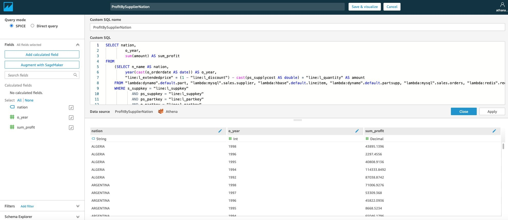

---

Trong bài labs này, chúng ta sẽ chứng minh các khả năng của Athena federation bằng cách sử dụng data source connectors, sau đó tạo QuickSight dashboards bằng cách sử dụng data source catalog.

### Thiết lập QuickSight để sử dụng connectors
1. Từ AWS services console, hãy điều hướng đến QuickSight (https://quicksight.aws.amazon.com/sn/start ).

2. Click vào Amazon QuickSight và nó sẽ tải một vài mẫu. Bạn có thể đóng cửa sổ thông báo tính năng mới.
3. Sau khi bạn đăng nhập vào QuickSight, hãy chọn **Manage QuickSight** trong tài khoản của bạn.

4. Trong ngăn điều hướng, chọn **Security & permissions**. Trong **QuickSight access to AWS services**, chọn **Manage**.

Một trang xuất hiện để cho phép bạn truy cập QuickSight vào các dịch vụ AWS.
5. Chọn **Athena** từ các tùy chọn. Trong cửa sổ bật lên, chọn **Next**.

6. Trên tab **Lambda**, chọn các Lambda functions tương ứng với các connectors mà Athena federated queries sử dụng. Chọn các  Lambda functions cho trình kết nối dynamo, hbase, mysql và redis rồi chọn **Finish**.

7. Trên QuickSight console, chọn **New analysis**.
8. Chọn **New dataset**.
9. Chọn **Athena** cho **Datasets**, nhập Athena-federation làm **Data source name**.
10. Đối với **Athena workgroup**, chọn **primary**.
11. Chọn **Create data source**.

12. Đối với **Catelog**, hãy chọn catelog được tạo cho các Athena federated connectors (dynamo, redis, hbase, mysql)

13. Đối với bài labs này, hãy chọn dynamo catalog để federation với Athena DynamoDB connector.

14. Chọn **Edit/Preview** trước dữ liệu để xem dữ liệu.

15. Để kết nối với Athena data source khác, chọn **Add data** và chọn **Data Source**

16. Chọn **Athena-federation** và nhấp vào **Select**. Chọn danh mục dynamo_db và bảng **partsupp** rồi nhấn **Select**

​17. Chọn liên kết nối giữa hai tập dữ liệu và chọn cấu hình nối thích hợp. Chọn **Apply**.
Xem joined data như dưới đây:

18.Chọn **Publish & Visualize** để bắt đầu sử dụng dữ liệu này nhằm tạo trực quan hóa trong QuickSight

### Chạy truy vấn trong QuickSight
Chúng ta sử dụng custom SQL trong QuickSight để chạy một truy vấn phức tạp với Athena federated data sources.

1. Trên QuickSight console, chọn **New analysis**.
2. Chọn **New dataset**
3. Đối với **Datasets**, chọn **Athena**.
4. Đối với **Data source name**, hãy nhập **Athena-federation**.
5. Đối với **Athena workgroup**, chọn **primary**.
6. Chọn **Create data source**.
7. Chọn **Use custom SQL**.
8. Nhập truy vấn cho ProfitBySupplierNation.
​
```
SELECT nation,
       o_year,
       sum(amount) AS sum_profit
       FROM 
       (SELECT n_name AS nation,
               year(cast(o_orderdate AS date)) AS o_year,
               "line:l_extendedprice" * (1 - "line:l_discount") - cast(ps_supplycost AS double) * "line:l_quantity" AS amount
        FROM "lambda:dynamo".default.part, "lambda:mysql".sales.supplier, "lambda:hbase".default.lineitem, 
             "lambda:dynamo".default.partsupp, "lambda:mysql".sales.orders, "lambda:redis".redis.nation
        WHERE s_suppkey = "line:l_suppkey"
        AND ps_suppkey = "line:l_suppkey"
        AND ps_partkey = "line:l_partkey"
        AND p_partkey = "line:l_partkey"
        AND o_orderkey = "line:l_orderkey"
        AND s_nationkey = cast(Regexp_extract(_key_, '.*-(.*)', 1) AS int)
        AND p_name LIKE '%green%' ) AS profit
        GROUP BY  nation, o_year
        ORDER BY  nation, o_year desc;   
```
9. Chọn **Edit/Preview data**.

10. Trong **Query mode**, chọn **SPICE**.
11. Chọn **Apply** rồi chọn **Publish & visualize**.


12. Trên trang Visualize, trong danh sách Trường, chọn **nation** và **sum_profit**. QuickSight tự động chọn loại hiển thị tốt nhất dựa trên các trường đã chọn. Bạn có thể thay đổi loại hình ảnh dựa trên yêu cầu của bạn.
​
Sau khi phân tích đã sẵn sàng, hãy chọn **Share** để tạo bảng thông tin và chia sẻ nó trong tổ chức của bạn.

### Optional
Dưới đây là các truy vấn đã lưu khác có thể được sử dụng để tạo Athena datasets:
**FetchActiveOrderInfo**
```
SELECT *
FROM "lambda:redis".redis.active_orders ao
LEFT JOIN "lambda:mysql".sales.orders o
     ON ao.orderkey = o_orderkey
LEFT JOIN "lambda:mysql".sales.customer c
     ON o_custkey = c_custkey
LEFT JOIN "lambda:hbase".default.lineitem l
     ON "line:l_orderkey" = o_orderkey
LEFT JOIN "lambda:dynamo".default.part p
     ON "line:l_partkey" = p.p_partkey
LEFT JOIN "lambda:dynamo".default.partsupp ps
     ON p.p_partkey = ps.ps_partkey
LEFT JOIN "lambda:mysql".sales.supplier s
     ON ps_suppkey = s_suppkey;
```

**OrdersRevenueDateAndShipPrio**
```
SELECT "line:l_orderkey",
       sum("line:l_extendedprice"*(1-"line:l_discount")) AS revenue,
       o_orderdate,
       o_shippriority
FROM "lambda:mysql".sales.customer c, "lambda:mysql".sales.orders o, "lambda:hbase".default.lineitem l
WHERE c_mktsegment = 'AUTOMOBILE'
      AND c_custkey = o_custkey
      AND "line:l_orderkey" = o_orderkey
GROUP BY  "line:l_orderkey", o_orderdate, o_shippriority
ORDER BY  revenue desc, o_orderdate
limit 10;
```

**SuppliersWhoKeptOrdersWaiting**
```
select
s_name, count(*) as numwait
from
   "lambda:mysql".sales.supplier,
   "lambda:hbase".default.lineitem l1,
   "lambda:mysql".sales.orders
where
   s_suppkey = "line:l_suppkey"
   and o_orderkey = "line:l_orderkey"
   and o_orderstatus = 'F'
   and "line:l_receiptdate" > "line:l_commitdate"
   and exists (
               select * 
               from
                   "lambda:hbase".default.lineitem
               where
                   "line:l_orderkey" = "line:l_orderkey"
               )
group by s_name
order by numwait desc,s_name;
```

**ShippedLineitemsPricingReport**
```
SELECT "line:l_returnflag","line:l_linestats",
sum(cast("line:l_quantity" AS double)) AS sum_qty,
sum(cast("line:l_extendedprice" AS double)) AS sum_base_price,
sum(cast("line:l_extendedprice" AS double)*(1-cast("line:l_discount" AS double))) AS sum_disc_price,
sum(cast("line:l_extendedprice" AS double)*(1-cast("line:l_discount" AS double))*(1+cast("line:l_tax" AS double))) AS sum_charge,
avg(cast("line:l_quantity" AS double)) AS avg_qty,
avg(cast("line:l_extendedprice" AS double)) AS avg_price,
avg(cast("line:l_discount" AS double)) AS avg_disc,
count(*) AS count_order
FROM "lambda:hbase".default.lineitem 
GROUP BY  "line:l_returnflag", "line:l_linestats"
ORDER BY  "line:l_returnflag", "line:l_linestats";
```