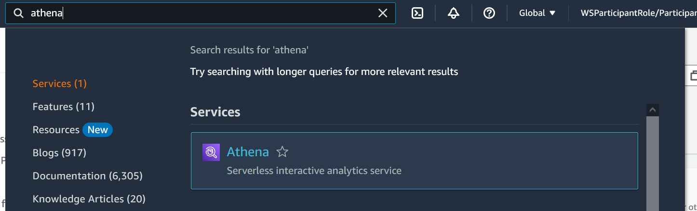

Bây giờ UDF Connector code đã được triển khai, chúng ta có thể chạy các truy vấn sử dụng UDF:

- Tìm kiếm Athena trong Services như hiển thị bên dưới:

- Đảm bảo bạn đang ở trong Workgroup: **V2EngineWorkGroup**. Nếu không nhấn vào Workgroup rồi chọn V2EngineWorkGroup và click **Switch Workgroup**

- Nhấp vào Saved Queries và chọn **RedactUdfCustomerAddress**

Bạn sẽ thấy nó như thế này:

Để tìm hiểu thêm về cú pháp UDF bấm vào đây:  UDF Query Syntax 
Click **Run query**. Khi truy vấn thực hiện thành công, bạn sẽ thấy kết quả như thế này:
